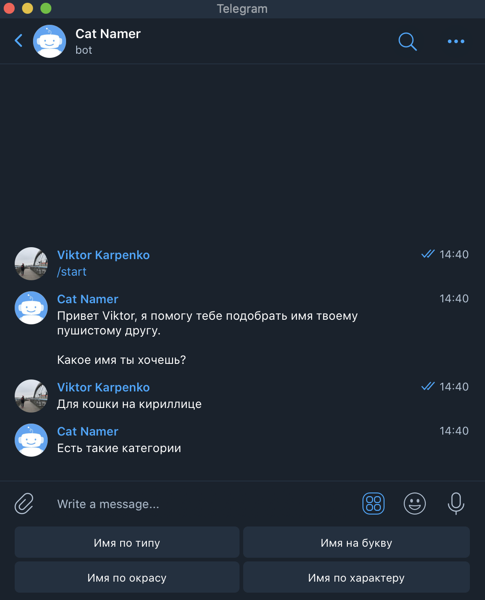
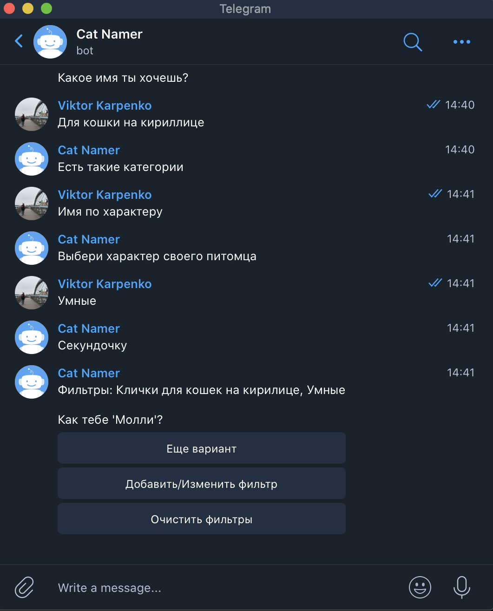
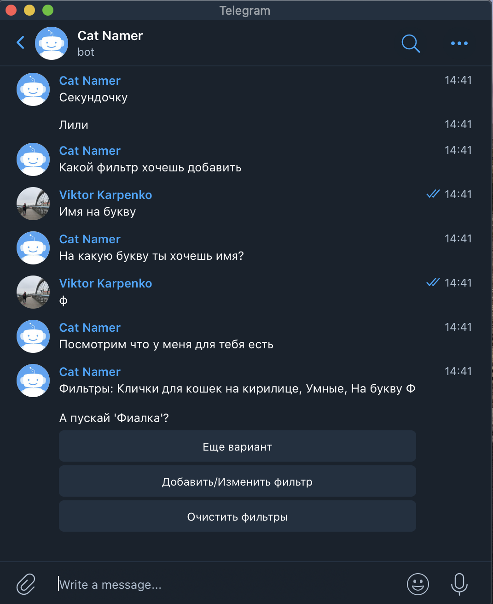

# "Pet namer" Telegram bot

This bot helps to invent a name for a cat. During development, 
I used PyTelegramBotAPI, SQLite3 database and BeautifulSoup for parsing names from site

### Let`s see 
Click on "start" button 

You can choose for whom and which name you want.

 

Let`s try "name for cats on cyrillic"

Afterwards you have four kinds of name

 

I choose "characters" => "smart"
 

Molly it is not bad, but I want the smart name that 
starts with the letter F.

And the bot gives me this opportunity

Than we can change the filters or ask for another name with this filters. 
Or reset the filters and start over.

Thanks for your time

P.S. Sorry for horrible english. I will be better